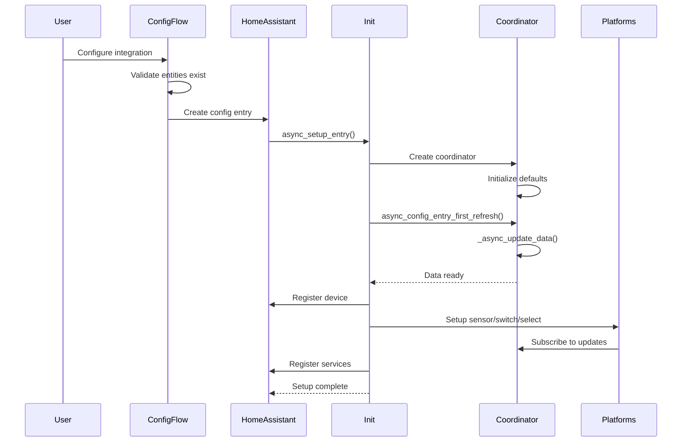

# Solar Energy Optimizer - Code Flow Documentation

## Overview

The Solar Energy Optimizer is a Home Assistant custom integration that optimizes battery charging and discharging based on energy prices, solar forecasts, and various optimization strategies. This document explains the complete code flow, architecture, and decision-making process.

---

## Table of Contents

1. [Architecture Overview](#architecture-overview)
2. [Entry Points](#entry-points)
3. [Component Initialization Flow](#component-initialization-flow)
4. [Data Flow](#data-flow)
5. [Business Logic & Optimization](#business-logic--optimization)
6. [Decision Points](#decision-points)
7. [User Interactions](#user-interactions)
8. [Platform Entities](#platform-entities)

---

## Architecture Overview

```
┌─────────────────────────────────────────────────────────────────────┐
│                         HOME ASSISTANT CORE                          │
└────────────────────────────┬────────────────────────────────────────┘
                             │
                             ▼
┌─────────────────────────────────────────────────────────────────────┐
│                    SOLAX ENERGY OPTIMIZER                            │
│                                                                       │
│  ┌──────────────┐    ┌──────────────┐    ┌──────────────┐          │
│  │ Config Flow  │───▶│   __init__   │───▶│  Coordinator │          │
│  │ (Setup UI)   │    │ (Entry Point)│    │ (Brain/Logic)│          │
│  └──────────────┘    └──────────────┘    └──────┬───────┘          │
│                                                    │                  │
│                                    ┌───────────────┼────────────┐    │
│                                    │               │            │    │
│                                    ▼               ▼            ▼    │
│                            ┌──────────┐   ┌──────────┐  ┌──────────┐│
│                            │ Sensors  │   │ Switches │  │  Select  ││
│                            └──────────┘   └──────────┘  └──────────┘│
└─────────────────────────────────────────────────────────────────────┘
                                    │
                                    ▼
┌─────────────────────────────────────────────────────────────────────┐
│                       EXTERNAL DEPENDENCIES                          │
│  ┌──────────────┐  ┌──────────────┐  ┌──────────────┐              │
│  │Solax Inverter│  │   Solcast    │  │Frank Energie │              │
│  │ (Battery SOC)│  │(Solar Fcst)  │  │ (Prices)     │              │
│  └──────────────┘  └──────────────┘  └──────────────┘              │
└─────────────────────────────────────────────────────────────────────┘
```

---

## Entry Points

### 1. Integration Registration
**File:** [`manifest.json`](manifest.json)

The integration is registered with Home Assistant through the manifest file:
- **Domain:** `solax_energy_optimizer`
- **Config Flow:** Enabled (UI-based setup)
- **Integration Type:** Service
- **IoT Class:** Calculated

### 2. Main Entry Point
**File:** [`__init__.py`](custom_components/solax_energy_optimizer/__init__.py)

```
User installs integration via UI
         │
         ▼
async_setup_entry() ←─────── Called by Home Assistant
         │
         ├─ Create Coordinator
         │
         ├─ Initial data fetch (async_config_entry_first_refresh)
         │
         ├─ Register device in device registry
         │
         ├─ Setup platforms (Sensor, Switch, Select)
         │
         └─ Register services (trigger_optimization)
```

**Key Function:** [`async_setup_entry()`](__init__.py:30-65)
- Creates the `EnergyOptimizerCoordinator`
- Performs initial data refresh
- Registers device in Home Assistant
- Sets up all platform entities
- Registers the `trigger_optimization` service

---

## Component Initialization Flow



### Config Flow
**File:** [`config_flow.py`](custom_components/solax_energy_optimizer/config_flow.py:27-122)

The configuration flow collects:
1. **Solax Inverter Entity** - Provides battery SOC
2. **Solcast Entity** - Provides solar production forecast
3. **Frank Energie Entity** - Provides energy prices
4. **Battery Capacity** (kWh)
5. **Max Charge/Discharge Rate** (kW)
6. **Min/Max SOC** (%)

**Validation:** Ensures all entities exist before creating the config entry.

---

## Data Flow

### Update Cycle

```
┌────────────────────────────────────────────────────────────────┐
│                    UPDATE CYCLE (Every 5 min)                   │
└────────────────────────────────────────────────────────────────┘
                              │
                              ▼
                  ┌───────────────────────┐
                  │  Coordinator Update   │
                  │  _async_update_data() │
                  └───────────┬───────────┘
                              │
        ┌─────────────────────┼─────────────────────┐
        │                     │                     │
        ▼                     ▼                     ▼
┌─────────────┐     ┌─────────────┐     ┌─────────────┐
│Fetch Battery│     │Fetch Solar  │     │Fetch Energy │
│    SOC      │     │  Forecast   │     │   Prices    │
└──────┬──────┘     └──────┬──────┘     └──────┬──────┘
       │                   │                    │
       └───────────────────┼────────────────────┘
                           │
                           ▼
                ┌──────────────────────┐
                │   Decision Gate:     │
                │ Automation Enabled?  │
                │ Manual Override Off? │
                └──────────┬───────────┘
                           │
                     YES   │   NO
                  ┌────────┴────────┐
                  ▼                 ▼
         ┌────────────────┐   ┌─────────┐
         │Run Optimization│   │  Idle   │
         │   Algorithm    │   └─────────┘
         └────────┬───────┘
                  │
                  ▼
         ┌────────────────┐
         │ Strategy Router│
         │ (See below)    │
         └────────┬───────┘
                  │
                  ▼
         ┌────────────────┐
         │  Update Data   │
         │ - next_action  │
         │ - target_soc   │
         │ - action_time  │
         └────────┬───────┘
                  │
                  ▼
         ┌────────────────┐
         │   Dry Run?     │
         └────┬──────┬────┘
              │      │
         YES  │      │  NO
              ▼      ▼
         ┌─────┐  ┌──────────────┐
         │ Log │  │Execute Action│
         └─────┘  │(TODO: Impl.) │
                  └──────────────┘
                         │
                         ▼
                  ┌─────────────┐
                  │Notify All   │
                  │Subscribers  │
                  │(Entities)   │
                  └─────────────┘
```

### Data Collection
**File:** [`coordinator.py`](custom_components/solax_energy_optimizer/coordinator.py:113-171)

**Method:** `_async_update_data()`

1. **Fetch Battery SOC** ([coordinator.py:118-125](custom_components/solax_energy_optimizer/coordinator.py#L118-L125))
   - Source: Solax Inverter entity
   - Converts state to float
   - Handles parse errors gracefully

2. **Fetch Solar Forecast** ([coordinator.py:128-132](custom_components/solax_energy_optimizer/coordinator.py#L128-L132))
   - Source: Solcast entity attributes
   - Extracts `forecasts` array
   - Contains PV estimates per time period

3. **Fetch Energy Prices** ([coordinator.py:135-145](custom_components/solax_energy_optimizer/coordinator.py#L135-L145))
   - Source: Frank Energie entity
   - Current price from state
   - Price array from attributes

---

## Business Logic & Optimization

### Optimization Strategy Router
**File:** [`coordinator.py`](custom_components/solax_energy_optimizer/coordinator.py:173-182)

```
                  ┌──────────────────────┐
                  │  _run_optimization() │
                  └──────────┬───────────┘
                             │
                             ▼
                    ┌────────────────┐
                    │  Switch on     │
                    │current_strategy│
                    └────────┬───────┘
                             │
        ┌────────────────────┼────────────────────┐
        │                    │                    │
        ▼                    ▼                    ▼
┌──────────────┐    ┌──────────────┐    ┌──────────────┐
│minimize_cost │    │maximize_self │    │     grid     │
│              │    │ consumption  │    │independence  │
└──────────────┘    └──────────────┘    └──────────────┘
        │                    │                    │
        └────────────────────┼────────────────────┘
                             │
                             ▼
                      ┌─────────────┐
                      │  balanced   │
                      └─────────────┘
```

### 1. Minimize Cost Strategy
**File:** [`coordinator.py`](custom_components/solax_energy_optimizer/coordinator.py:184-237)

**Objective:** Charge when prices are low, discharge when prices are high

**Algorithm:**
```
1. Get all prices for current day
2. Filter prices from current hour onwards
3. Sort prices to find min/max
4. Calculate price thresholds:
   - Low threshold = min_price + (range × 0.25)
   - High threshold = max_price - (range × 0.25)
5. Decision logic:
   IF current_price ≤ low_threshold AND battery_soc < max_soc
      → ACTION: CHARGE to max_soc
   ELSE IF current_price ≥ high_threshold AND battery_soc > min_soc
      → ACTION: DISCHARGE to min_soc
   ELSE
      → ACTION: IDLE
```

**Decision Tree:**
```
                    Current Price?
                         │
         ┌───────────────┼───────────────┐
         │               │               │
    Low (≤25%)      Medium (25-75%)  High (≥75%)
         │               │               │
         ▼               ▼               ▼
    Battery < Max?    ┌──────┐     Battery > Min?
         │            │ IDLE │          │
    YES  │  NO        └──────┘     YES  │  NO
         ▼    │                          ▼    │
    ┌────────┐│                     ┌────────┐│
    │ CHARGE ││                     │DISCHARGE││
    │to Max  ││                     │to Min   ││
    └────────┘│                     └─────────┘│
              │                                 │
              ▼                                 ▼
         ┌──────┐                          ┌──────┐
         │ IDLE │                          │ IDLE │
         └──────┘                          └──────┘
```

### 2. Maximize Self-Consumption Strategy
**File:** [`coordinator.py`](custom_components/solax_energy_optimizer/coordinator.py:239-267)

**Objective:** Ensure battery has space to store excess solar production

**Algorithm:**
```
1. Get solar forecast
2. Find next significant solar period (> 1.0 kW)
3. Decision logic:
   IF solar production expected:
      IF battery_soc > (max_soc - 20%):
         → ACTION: DISCHARGE to (max_soc - 20%)
            (Make room for solar)
      ELSE:
         → ACTION: IDLE
   ELSE:
      → ACTION: IDLE
```

**Flow:**
```
    Solar Forecast Available?
              │
        YES   │   NO
        ┌─────┴─────┐
        ▼           ▼
Next Solar > 1kW?  IDLE
        │
   YES  │   NO
   ┌────┴────┐
   ▼         ▼
Battery > 75%?  IDLE
   │
YES│   NO
   ▼    │
DISCHARGE│
(free up)│
   │     │
   └─────┴─────▶ IDLE
```

### 3. Grid Independence Strategy
**File:** [`coordinator.py`](custom_components/solax_energy_optimizer/coordinator.py:269-282)

**Objective:** Keep battery as charged as possible to minimize grid dependence

**Algorithm:**
```
1. Check current battery SOC
2. Decision logic:
   IF battery_soc < max_soc:
      → ACTION: CHARGE to max_soc
   ELSE:
      → ACTION: IDLE
```

**Simple Flow:**
```
    Battery < Max SOC?
           │
      YES  │  NO
           │
      ┌────┴────┐
      ▼         ▼
   CHARGE      IDLE
   to Max
```

### 4. Balanced Strategy
**File:** [`coordinator.py`](custom_components/solax_energy_optimizer/coordinator.py:284-312)

**Objective:** Balance cost optimization with self-consumption

**Algorithm:**
```
1. Get all future prices
2. Calculate average price
3. Decision logic:
   IF current_price < (avg_price × 0.9) AND battery_soc < max_soc:
      → ACTION: CHARGE to max_soc
   ELSE IF current_price > (avg_price × 1.1) AND battery_soc > min_soc:
      → ACTION: DISCHARGE to min_soc
   ELSE:
      → ACTION: IDLE
```

**Decision Tree:**
```
                Calculate Avg Price
                        │
                        ▼
            Current vs Average?
                        │
         ┌──────────────┼──────────────┐
         │              │              │
    < 90% Avg      90%-110% Avg    > 110% Avg
         │              │              │
         ▼              ▼              ▼
  Battery < Max?    ┌──────┐    Battery > Min?
         │          │ IDLE │          │
    YES  │  NO      └──────┘     YES  │  NO
         ▼    │                        ▼    │
    ┌────────┐│                   ┌────────┐│
    │ CHARGE ││                   │DISCHARGE││
    └────────┘│                   └────────┘│
              ▼                             ▼
           IDLE                          IDLE
```

---

## Decision Points

### Master Control Flow

```
┌─────────────────────────────────────────────────────────────┐
│                  DECISION CONTROL GATES                      │
└─────────────────────────────────────────────────────────────┘

Gate 1: Automation Enabled?
  ├─ YES → Continue to Gate 2
  └─ NO  → Skip optimization, set action to IDLE

Gate 2: Manual Override Active?
  ├─ YES → Skip optimization, set action to IDLE
  └─ NO  → Continue to Gate 3

Gate 3: Which Strategy?
  ├─ minimize_cost
  ├─ maximize_self_consumption
  ├─ grid_independence
  └─ balanced

Gate 4: Dry Run Mode?
  ├─ YES → Log action only, don't execute
  └─ NO  → Execute action (call inverter API)

Gate 5: Action Execution (Production Mode Only)
  ├─ CHARGE   → Set battery to charge mode
  ├─ DISCHARGE → Set battery to discharge mode
  └─ IDLE     → Set battery to idle/automatic mode
```

**Key Decision Variables:**
- `automation_enabled` - Master on/off switch ([coordinator.py:84-91](custom_components/solax_energy_optimizer/coordinator.py#L84-L91))
- `manual_override` - User manual control flag ([coordinator.py:94-101](custom_components/solax_energy_optimizer/coordinator.py#L94-L101))
- `dry_run_mode` - Safety mode (default: ON) ([coordinator.py:104-111](custom_components/solax_energy_optimizer/coordinator.py#L104-L111))
- `current_strategy` - Selected optimization approach ([coordinator.py:74-81](custom_components/solax_energy_optimizer/coordinator.py#L74-L81))

---

## User Interactions

### Available Controls

```
┌───────────────────────────────────────────────────────────────┐
│                    USER INTERFACE ENTITIES                     │
└───────────────────────────────────────────────────────────────┘

SELECT ENTITY (Strategy Selector)
  ├─ minimize_cost              ← Choose optimization strategy
  ├─ maximize_self_consumption
  ├─ grid_independence
  └─ balanced

SWITCH ENTITIES (Control Switches)
  ├─ Automation Enabled         ← Master on/off
  ├─ Manual Override            ← Pause automation
  └─ Dry Run Mode              ← Safe testing mode

SENSOR ENTITIES (Read-Only Status)
  ├─ Next Action               ← charge/discharge/idle
  ├─ Next Action Time          ← When action will execute
  ├─ Daily Cost                ← Today's cost (€)
  ├─ Daily Savings             ← Today's savings (€)
  ├─ Monthly Cost              ← Month total (€)
  └─ Monthly Savings           ← Month savings (€)

SERVICE
  └─ trigger_optimization       ← Manual trigger
```

### User Interaction Flow

```
User enables "Automation Enabled" switch
         │
         ▼
User selects strategy (e.g., "minimize_cost")
         │
         ▼
User monitors "Next Action" sensor
         │
         ▼
Coordinator runs optimization every 5 min
         │
         ▼
Next Action updates (charge/discharge/idle)
         │
         ▼
User can toggle "Dry Run Mode" OFF for production
         │
         ▼
Actions execute on inverter (when not dry run)
```

---

## Platform Entities

### Sensor Platform
**File:** [`sensor.py`](custom_components/solax_energy_optimizer/sensor.py)

Creates 6 sensor entities:
1. **Next Action** ([sensor.py:47-52](custom_components/solax_energy_optimizer/sensor.py#L47-L52))
   - Shows: charge/discharge/idle
   - Attributes: battery_soc, current_price, target_soc, strategy, dry_run_mode

2. **Next Action Time** ([sensor.py:54-58](custom_components/solax_energy_optimizer/sensor.py#L54-L58))
   - Shows: timestamp of next action

3. **Daily Cost** ([sensor.py:60-66](custom_components/solax_energy_optimizer/sensor.py#L60-L66))
   - Shows: daily energy cost (€)

4. **Daily Savings** ([sensor.py:68-75](custom_components/solax_energy_optimizer/sensor.py#L68-L75))
   - Shows: daily savings (€)

5. **Monthly Cost** ([sensor.py:77-83](custom_components/solax_energy_optimizer/sensor.py#L77-L83))
   - Shows: monthly energy cost (€)

6. **Monthly Savings** ([sensor.py:85-92](custom_components/solax_energy_optimizer/sensor.py#L85-L92))
   - Shows: monthly savings (€)

### Switch Platform
**File:** [`switch.py`](custom_components/solax_energy_optimizer/switch.py)

Creates 3 switch entities:

1. **Automation Enabled** ([switch.py:35-71](custom_components/solax_energy_optimizer/switch.py#L35-L71))
   - Controls: Whether optimization runs
   - On: Optimization active
   - Off: Optimization paused

2. **Manual Override** ([switch.py:73-109](custom_components/solax_energy_optimizer/switch.py#L73-L109))
   - Controls: Temporary pause for manual control
   - On: User controls battery manually
   - Off: Automation controls battery

3. **Dry Run Mode** ([switch.py:111-145](custom_components/solax_energy_optimizer/switch.py#L111-L145))
   - Controls: Safe testing mode
   - On: Actions logged only (default)
   - Off: Actions executed on inverter

### Select Platform
**File:** [`select.py`](custom_components/solax_energy_optimizer/select.py)

Creates 1 select entity:

1. **Strategy** ([select.py:29-59](custom_components/solax_energy_optimizer/select.py#L29-L59))
   - Options:
     - minimize_cost
     - maximize_self_consumption
     - grid_independence
     - balanced
   - Triggers: Immediate refresh on change

---

## Service: trigger_optimization

**File:** [`__init__.py`](custom_components/solax_energy_optimizer/__init__.py:55-63)

**Service:** `solax_energy_optimizer.trigger_optimization`

**Purpose:** Manually trigger an immediate optimization run

**Flow:**
```
User calls service
      │
      ▼
handle_trigger_optimization()
      │
      ▼
coordinator.async_request_refresh()
      │
      ▼
_async_update_data() executes immediately
      │
      ▼
Optimization runs
      │
      ▼
Entities updated
```

---

## Data Models

### EnergyOptimizerData
**File:** [`coordinator.py`](custom_components/solax_energy_optimizer/coordinator.py:35-52)

Stores all optimization data:
```python
{
    battery_soc: float | None           # Current battery charge %
    solar_production: float | None      # Current solar output
    current_price: float | None         # Current energy price
    prices_today: list[dict]            # Today's price schedule
    prices_tomorrow: list[dict]         # Tomorrow's prices
    solar_forecast: list[dict]          # Solar production forecast
    next_action: str                    # charge/discharge/idle
    next_action_time: datetime | None   # When to execute
    target_soc: float | None            # Target battery %
    daily_cost: float                   # Daily energy cost
    daily_savings: float                # Daily savings
    monthly_cost: float                 # Monthly cost
    monthly_savings: float              # Monthly savings
}
```

---

## Configuration

### User Inputs (Config Flow)
**File:** [`config_flow.py`](custom_components/solax_energy_optimizer/config_flow.py:59-116)

Required during setup:
- **Solax Inverter Entity** - sensor.xxx
- **Solcast Entity** - sensor.xxx
- **Frank Energie Entity** - sensor.xxx
- **Battery Capacity** - 1-100 kWh
- **Max Charge Rate** - 0.1-50 kW
- **Max Discharge Rate** - 0.1-50 kW
- **Min SOC** - 0-100% (default: 20%)
- **Max SOC** - 0-100% (default: 95%)

### Constants
**File:** [`const.py`](custom_components/solax_energy_optimizer/const.py)

- **Update Interval:** 5 minutes ([const.py:20](custom_components/solax_energy_optimizer/const.py#L20))
- **Default Min SOC:** 20% ([const.py:18](custom_components/solax_energy_optimizer/const.py#L18))
- **Default Max SOC:** 95% ([const.py:19](custom_components/solax_energy_optimizer/const.py#L19))

---

## Complete Flow Summary

```
┌──────────────────────────────────────────────────────────────────┐
│                    COMPLETE SYSTEM FLOW                           │
└──────────────────────────────────────────────────────────────────┘

1. USER SETUP
   └─ Configure via UI (Config Flow)
      └─ Select entity sources, battery specs, SOC limits

2. INITIALIZATION
   └─ async_setup_entry() creates coordinator
      └─ async_config_entry_first_refresh() fetches initial data
         └─ Register device & entities
            └─ Register service

3. RUNTIME LOOP (Every 5 minutes)
   └─ Coordinator update triggered
      ├─ Fetch battery SOC from Solax
      ├─ Fetch solar forecast from Solcast
      └─ Fetch energy prices from Frank Energie

   └─ Check control gates
      ├─ Automation enabled? (YES → continue)
      └─ Manual override? (NO → continue)

   └─ Run optimization algorithm
      ├─ Select strategy
      │  ├─ minimize_cost
      │  ├─ maximize_self_consumption
      │  ├─ grid_independence
      │  └─ balanced
      │
      └─ Calculate action
         ├─ CHARGE (+ target SOC)
         ├─ DISCHARGE (+ target SOC)
         └─ IDLE

   └─ Execute or log action
      ├─ Dry run mode → Log only
      └─ Production mode → Execute on inverter

   └─ Update all entities
      └─ Notify UI

4. USER MONITORING
   └─ View sensors
      ├─ Next action
      ├─ Costs & savings
      └─ Action timing

   └─ Control behavior
      ├─ Change strategy (Select)
      ├─ Toggle automation (Switch)
      ├─ Manual override (Switch)
      └─ Dry run mode (Switch)

5. MANUAL TRIGGER
   └─ Call service: trigger_optimization
      └─ Immediate optimization run
```

---

## Key Files Reference

| File | Purpose | Lines of Code |
|------|---------|---------------|
| [`manifest.json`](manifest.json) | Integration metadata | 13 |
| [`__init__.py`](__init__.py) | Entry point, setup | 73 |
| [`const.py`](const.py) | Constants & config keys | 61 |
| [`coordinator.py`](coordinator.py) | Core logic & optimization | 320 |
| [`config_flow.py`](config_flow.py) | Setup UI flow | 123 |
| [`sensor.py`](sensor.py) | Status sensors | 150 |
| [`switch.py`](switch.py) | Control switches | 145 |
| [`select.py`](select.py) | Strategy selector | 59 |

---

## Safety Features

1. **Dry Run Mode (Default: ON)**
   - All actions logged but not executed
   - User must explicitly disable for production

2. **Manual Override**
   - User can pause automation anytime
   - Prevents conflicts with manual control

3. **SOC Limits**
   - Min SOC prevents deep discharge
   - Max SOC prevents overcharging

4. **Entity Validation**
   - Config flow validates all entity IDs exist
   - Graceful error handling for missing data

---

## Future Enhancements (TODO)

**File:** [`coordinator.py`](custom_components/solax_energy_optimizer/coordinator.py:159-166)

Currently at line 166:
```python
# TODO: Implement actual inverter control
# await self._execute_action(data.next_action, data.target_soc)
```

**Required:** Implement inverter API calls to actually control charging/discharging behavior when dry run mode is OFF.

---

## Summary

The Solar Energy Optimizer is a well-structured Home Assistant integration that:

1. **Collects data** from multiple sources (inverter, solar forecast, energy prices)
2. **Runs optimization algorithms** based on user-selected strategies
3. **Makes intelligent decisions** about when to charge/discharge batteries
4. **Provides visibility** through sensors and monitoring
5. **Allows user control** through switches and strategy selection
6. **Operates safely** with dry run mode by default

The code follows Home Assistant best practices with proper coordinator pattern, entity platforms, and config flow implementation.
